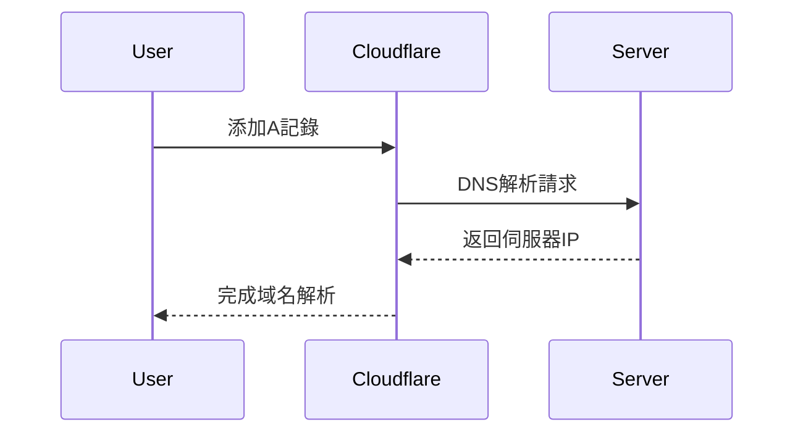
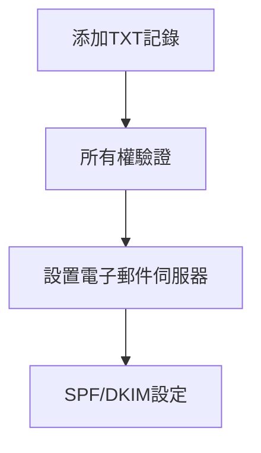

# Cloudflare 域名設置與維護指南

## 目錄
1. [DNS基本設定](#1-dns基本設定)
2. [SSL證書配置](#2-ssl證書配置)
3. [域名驗證流程](#3-域名驗證流程)
4. [防火牆規則設定](#4-防火牆規則設定)
5. [效能優化配置](#5-效能優化配置)
6. [部署驗證步驟](#6-部署驗證步驟)
7. [疑難排解](#7-疑難排解)

## 1. DNS基本設定


### 操作步驟：
1. 登入 Cloudflare 控制台
2. 選擇目標域名 > DNS > 記錄
3. 添加A記錄：
   ```ini
   類型：A
   名稱：@ 或子域名 (如 www)
   IPv4 地址：your_server_ip
   TTL：自動
   代理狀態：🚀 已代理 (橘色雲圖示)
   ```
4. 同樣方式添加CNAME記錄(如需)

## 2. SSL證書配置
### 伺服器端操作：
```bash
# 生成SSL證書 (自動獲取Let's Encrypt證書)
./scripts/generate-ssl.sh \
  --domain yourdomain.com \
  --email admin@yourdomain.com \
  --cloudflare
```

### Cloudflare 控制台設定：
1. SSL/TLS > 概觀：
   - 加密模式：完全 (嚴格模式)
2. SSL/TLS > 邊界憑證：
   ```yaml
   作用域: 包含根網域和所有子域
   有效期: 15年
   密鑰類型: ECC
   ```
3. 規則 > 自動HTTPS重寫：啟用

## 3. 域名驗證流程


### 必要DNS記錄：
| 類型 | 名稱       | 值                          | 說明                |
|------|------------|-----------------------------|---------------------|
| TXT  | @          | v=spf1 include:_spf.google.com ~all | 郵件伺服器驗證      |
| MX   | @          | 10 mx.example.com           | 郵件交換記錄        |
| TXT  | _dmarc     | v=DMARC1; p=none; rua=mailto:admin@yourdomain.com | 防偽郵件策略 |

## 4. 防火牆規則設定
### Nginx配置範例 (`nginx/conf.d/prod.conf.template`):
```nginx
# Cloudflare IP白名單
include /etc/nginx/cloudflare-ips.conf;

server {
    listen 443 ssl http2;
    server_name yourdomain.com;
    
    # SSL證書配置
    ssl_certificate /etc/nginx/certs/prod_yourdomain.crt;
    ssl_certificate_key /etc/nginx/certs/prod_yourdomain.key;
    
    # 安全標頭
    add_header Strict-Transport-Security "max-age=63072000; includeSubDomains; preload";
    add_header X-Content-Type-Options nosniff;
    
    # 訪問控制
    allow 173.245.48.0/20;
    allow 103.21.244.0/22;
    deny all;
    
    ...其他配置...
}
```

## 5. 效能優化配置
1. **快取策略**：
   - 規則 > 快取規則 > 新建規則：
     ```yaml
     路徑包含：/*
     邊界快取TTL：1個月
     瀏覽器快取TTL：1小時
     ```
     
2. **進階壓縮**：
   - 速度 > 內容最佳化：
     ```ini
     Brotli壓縮：啟用
     Rocket Loader：啟用
     ```

3. **網路協定支援**：
   - 網路 > HTTP/3 (QUIC)：啟用
   - 網路 > 0-RTT 連線加速：啟用

## 6. 部署驗證步驟
### 指令檢查清單：
```bash
# DNS解析驗證
dig yourdomain.com +short
nslookup yourdomain.com 8.8.8.8

# SSL證書檢查
openssl s_client -connect yourdomain.com:443 -servername yourdomain.com | openssl x509 -text -noout

# 完整連線測試
curl -Iv https://yourdomain.com \
  -H "Host: yourdomain.com" \
  -H "User-Agent: Mozilla/5.0 (compatible; MonitoringBot/1.0)"
```

## 7. 疑難排解
### 常見問題處理：
1. **DNS傳播延遲**：
   ```bash
   # 多地區DNS查詢驗證
   dig +short yourdomain.com @1.1.1.1  # Cloudflare
   dig +short yourdomain.com @8.8.8.8  # Google
   ```

2. **SSL憑證錯誤**：
   ```bash
   # 重新生成證書
   ./scripts/generate-ssl.sh --force-renew --domain yourdomain.com

   # 檢查證書鏈
   openssl s_client -showcerts -connect yourdomain.com:443
   ```

3. **防火牆阻擋**：
   ```bash
   # 檢查伺服器防火牆規則
   sudo ufw status verbose
   sudo iptables -L -n -v
   ```

### 監控告警設定建議：
1. 在Cloudflare控制台啟用：
   - 安全性 > 通知 > 異常流量警報
   - 報告 > 自訂監控告警
2. 設定通知管道：
   ```ini
   通知方式: Email/Slack/Webhook
   觸發條件: 
     - HTTP錯誤率 > 5%
     - 每秒請求數突增300%
   ```

> 最後更新日期：2025/3/22  
> 維護團隊：SrLWordpress DevOps Team
